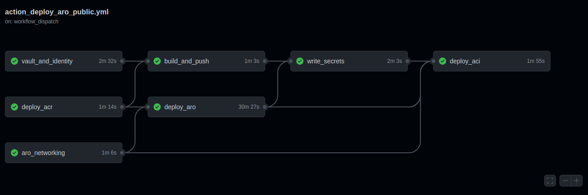
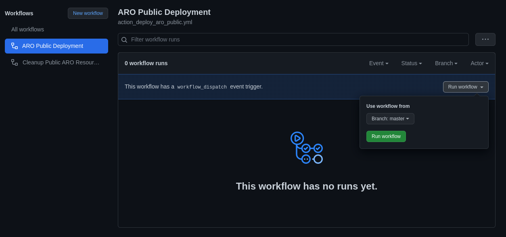
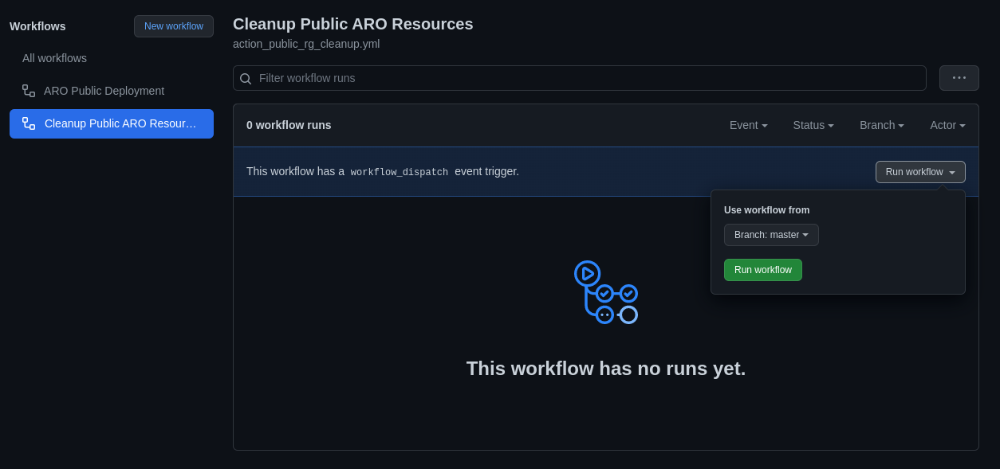

Deploying Azure Red Hat OpenShift (ARO) is a fairly straightforward process. By following the [official documentation](https://docs.microsoft.com/en-au/azure/openshift/intro-openshift), creating the required Azure infrastructure and running the deployment command, a highly available OpenShift cluster will become available and ready to run containerised workloads in approximately 30 minutes. This repo aims to automate that process.

# Architecture

A single resource group containing the virtual network and the OpenShift resource

# Github actions deployment 

Using the github actions workflow the bicep modules can be deployed from a github repo. The github actions deployment will be scoped to the resource group level. This means that there will initally be a additional steps to create a service principal, resource groups and assign the appropriate permissions. These steps will only have to be run once for as long as the resource groups and service principal remain within the Azure environment. The github actions workflow will use public runners unless otherwise configured.



> :warning: Please be careful about how you store secrets. It is advised to use a private repo to ensure that there is a less chance of private data exposure.

## Github actions prerequisites

### Create resource groups

> :warning: Try not to delete the resource groups once created or you will need to run the permissions commands again.

As a user run the following command to create resource groups that will be used for the github actions deployment.

```
$ export SUBSCRIPTION=$(az account show --query id -o tsv)
$ export LOCATION=<insert location here>
$ export ARO_RG="<insert hub resource group name here>"

$ az group create -n $ARO_RG -l $LOCATION

```
### Create a service principal

Create a service principal that will run the github actions bicep modules. This SP will also be granted "User access admin" permission on the spoke resource group, this is to ensure that the ARO deployment can assign the resource provider "Red Hat OpenShift RP" permissions to the spoke resource group.

```
$ export SP_NAME="<insert name for the service principal here>"

$ az ad sp create-for-rbac -n $SP_NAME --role contributor --sdk-auth --scopes "/subscriptions/$SUBSCRIPTION/resourceGroups/$ARO_RG" > sp.txt

$ export AAD_CLIENT_ID=$(az ad sp list --all --query "[?displayName == '$SP_NAME'].appId" -o tsv)

```

### Scope the service principal's permissions to the resource group

```
$ export SCOPE_RG=$(az group show -n $ARO_RG --query id -o tsv)


$ az role assignment create --assignee $AAD_CLIENT_ID --role contributor --scope $SCOPE_RG
$ az role assignment create --assignee $AAD_CLIENT_ID --role "User Access Administrator" --scope $SCOPE_RG

```

### Modify parameter

1. Modify the parameters found in `./action_params/*.json` to suit your environment.

1. Modify the parameters found in `./github/workflows/action_deploy_aro_public.yml` and `./github/workflows/action_public_rg_cleanup.yml` to suit your environment.
    * LOCATION (location for resources)

### Create github encrypted secrets to be used by github actions

The following secrets will need to be created in the github repository as "Action Secrets". Go to your repo > select settings > select secrets > select Actions > select "New repository secret".

| Secret Name | Command to run to get correct value for secret | 
| --- | --- | 
| AZURE_SUBSCRIPTION | ` az account show --query id -o tsv ` | 
| AZURE_CREDENTIALS | copy the contents of sp.txt here. Json format will work | 
| AAD_CLIENT_ID | `az ad sp list --all --query "[?displayName == '$SP_NAME'].appId" -o tsv` |
| AAD_CLIENT_SECRET | `cat sp.txt \| jq -r .clientSecret ` | 
| AAD_OBJECT_ID | `az ad sp show --id $AAD_CLIENT_ID --query id -o tsv`  |
| ARO_RP_OB_ID | `az ad sp list --all --query "[?appDisplayName=='Azure Red Hat OpenShift RP'].id" -o tsv` |
| RESOURCEGROUP | \<insert the resource group name\> | 
| PULL_SECRET | Format the Red Hat Pull Secret with the following command `cat pull-secret.json \| sed 's/"/\\"/g'` then place the output into the secret

> :Note: The pull secret should have the following syntax prior to adding it to the github secret `{\"auths\":{\"cloud.openshift.com\":{\"auth\":\"XXXXXXXXXX\" ...`

## Github actions Deployment

To run the github actions to deploy the environment select the following;



## Github actions Cleanup

To run the github actions to deploy the environment select the following;



# **Pull Requests are welcome!**